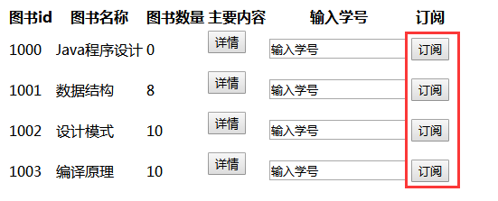

## 简单介绍
springMVC是基于Servlet API，是Spring框架中最早的框架，spring4提倡用Java config的配置方式，spring5.0发布之后介绍了一个跟spring MVC平行的框架叫spring-webflux，以后慢慢学习，本篇示例来自https://blog.csdn.net/qq598535550/article/details/51703190   整合了spring,springMVC和mybatis,在这里梳理了一下框架的搭建过程，感谢原作者。
## 新建项目  
- 新建一个maven web项目,在初始化框架里选择maven-archetype-webapp,GroupId一般填写的是公司名（com.demo），ArtifactId填写项目名(ssm)；
- 新建项目路径 src/main/java 右键选择 mark Directory as sources root;src/main/resources 右键选择 mark as resources root;
- 配置tomcat 在idea界面右上角有一个配置图形，点击add Configuration面板左边有一个加号选择添加Tomcat Server->local->配置本地安装地址->部署项目 这里涉及到热部署的问题之后补充
- 运行检查一下是否无误     
## 相关配置
- pom.xml 引入相关依赖     
```
    <!-- 1.日志 -->
    <!-- 实现slf4j接口并整合 -->
    <dependency>
      <groupId>ch.qos.logback</groupId>
      <artifactId>logback-classic</artifactId>
      <version>1.1.1</version>
    </dependency>

    <!-- 2.数据库 -->
    <dependency>
      <groupId>mysql</groupId>
      <artifactId>mysql-connector-java</artifactId>
      <version>5.1.37</version>
      <scope>runtime</scope>
    </dependency>
    <dependency>
      <groupId>c3p0</groupId>
      <artifactId>c3p0</artifactId>
      <version>0.9.1.2</version>
    </dependency>

    <!-- DAO: MyBatis -->
    <dependency>
      <groupId>org.mybatis</groupId>
      <artifactId>mybatis</artifactId>
      <version>3.3.0</version>
    </dependency>
    <dependency>
      <groupId>org.mybatis</groupId>
      <artifactId>mybatis-spring</artifactId>
      <version>1.2.3</version>
    </dependency>

    <!-- 3.Servlet web -->
    <dependency>
      <groupId>taglibs</groupId>
      <artifactId>standard</artifactId>
      <version>1.1.2</version>
    </dependency>
    <dependency>
      <groupId>jstl</groupId>
      <artifactId>jstl</artifactId>
      <version>1.2</version>
    </dependency>
    <dependency>
      <groupId>com.fasterxml.jackson.core</groupId>
      <artifactId>jackson-databind</artifactId>
      <version>2.5.4</version>
    </dependency>
    <dependency>
      <groupId>javax.servlet</groupId>
      <artifactId>javax.servlet-api</artifactId>
      <version>3.1.0</version>
    </dependency>

    <!-- 4.Spring -->
    <!-- 1)Spring核心 -->
    <dependency>
      <groupId>org.springframework</groupId>
      <artifactId>spring-core</artifactId>
      <version>4.1.7.RELEASE</version>
    </dependency>
    <dependency>
      <groupId>org.springframework</groupId>
      <artifactId>spring-beans</artifactId>
      <version>4.1.7.RELEASE</version>
    </dependency>
    <dependency>
      <groupId>org.springframework</groupId>
      <artifactId>spring-context</artifactId>
      <version>4.1.7.RELEASE</version>
    </dependency>
    <!-- 2)Spring DAO层 -->
    <dependency>
      <groupId>org.springframework</groupId>
      <artifactId>spring-jdbc</artifactId>
      <version>4.1.7.RELEASE</version>
    </dependency>
    <dependency>
      <groupId>org.springframework</groupId>
      <artifactId>spring-tx</artifactId>
      <version>4.1.7.RELEASE</version>
    </dependency>
    <!-- 3)Spring web -->
    <dependency>
      <groupId>org.springframework</groupId>
      <artifactId>spring-web</artifactId>
      <version>4.1.7.RELEASE</version>
    </dependency>
    <dependency>
      <groupId>org.springframework</groupId>
      <artifactId>spring-webmvc</artifactId>
      <version>4.1.7.RELEASE</version>
    </dependency>
    <!-- 4)Spring test -->
    <dependency>
      <groupId>org.springframework</groupId>
      <artifactId>spring-test</artifactId>
      <version>4.1.7.RELEASE</version>
    </dependency>

    <!-- redis客户端:Jedis -->
    <dependency>
      <groupId>redis.clients</groupId>
      <artifactId>jedis</artifactId>
      <version>2.7.3</version>
    </dependency>
    <dependency>
      <groupId>com.dyuproject.protostuff</groupId>
      <artifactId>protostuff-core</artifactId>
      <version>1.0.8</version>
    </dependency>
    <dependency>
      <groupId>com.dyuproject.protostuff</groupId>
      <artifactId>protostuff-runtime</artifactId>
      <version>1.0.8</version>
    </dependency>

    <!-- Map工具类 -->
    <dependency>
      <groupId>commons-collections</groupId>
      <artifactId>commons-collections</artifactId>
      <version>3.2</version>
    </dependency>
```
## spring的配置文件
### springmvc  
- 在src/main/resources下建立spring文件夹存放spring的配置文件，首先配置springMVC所需要的配置文件,spring-web.xml,需要的配置主要有注解驱动，静态资源加载，视图映射,和包扫描。
- src\main\webapp\WEB-INF\web.xml 配置servlet,加载配置文件  
### 数据库相关配置   
- src\main\resources\jdbc.properties 需要配置driver,url,username和password  
### mybatis配置文件  
- 使用自增主键
- 使用列别名
- 开启驼峰命名转换 create_time -> createTime
### spring 整合 mybatis的配置文件 spring-dao.xml
- 读入数据库连接相关参数（可选）  
- 配置数据连接池  
配置连接属性，可以不读配置项文件直接在这里写死  
配置c3p0，只配了几个常用的  
- 配置SqlSessionFactory对象（mybatis）  
- 扫描dao层接口，动态实现dao接口，也就是说不需要daoImpl，sql和参数都写在xml文件上  
### spring配置service  spring-service  
- 扫描service包所有注解 @Service
- 配置事务管理器，把事务管理交由spring来完成
- 配置基于注解的声明式事务，可以直接在方法上@Transaction
### 配置输出日志 这里我用的是log4j  
- 加入依赖包
```
    <!-- https://mvnrepository.com/artifact/log4j/log4j -->
    <dependency>
      <groupId>log4j</groupId>
      <artifactId>log4j</artifactId>
      <version>1.2.17</version>
    </dependency>
  </dependencies>
```
- 在resources下添加配置文件log4j.properties   为了之后调试方便将日志等级设置为DEBUG
```
log4j.rootLogger=DEBUG, Console
log4j.appender.Console=org.apache.log4j.ConsoleAppender
log4j.appender.Console.layout=org.apache.log4j.PatternLayout
log4j.appender.Console.layout.ConversionPattern=%-5p [%c] :: %m%n
log4j.appender.org.apache=INFO
log4j.logger.org.apache.ibatis.io=INFO
log4j.logger.org.apache.ibatis.logging.LogFactory=INFO
log4j.logger.java.sql.Connection=DEBUG
log4j.logger.java.sql.Statement=DEBUG
log4j.logger.java.sql.PreparedStatement=DEBUG
log4j.logger.com.opensymphony.xwork2=INFO
log4j.logger.org.apache.struts2.dispatcher=INFO
log4j.logger.org.apache.struts2.json.JSONUtil=INFO
```
## 具体实例   
### dao
- 创建数据库及数据表
```
-- 创建图书表
CREATE TABLE `book` (
  `book_id` bigint(20) NOT NULL AUTO_INCREMENT COMMENT '图书ID',
  `name` varchar(100) NOT NULL COMMENT '图书名称',
  `number` int(11) NOT NULL COMMENT '馆藏数量',
  PRIMARY KEY (`book_id`)
) ENGINE=InnoDB AUTO_INCREMENT=1000 DEFAULT CHARSET=utf8 COMMENT='图书表'

-- 初始化图书数据
INSERT INTO `book` (`book_id`, `name`, `number`)
VALUES
    (1000, 'Java程序设计', 10),
    (1001, '数据结构', 10),
    (1002, '设计模式', 10),
    (1003, '编译原理', 10)

-- 创建预约图书表
CREATE TABLE `appointment` (
  `book_id` bigint(20) NOT NULL COMMENT '图书ID',
  `student_id` bigint(20) NOT NULL COMMENT '学号',
  `appoint_time` timestamp NOT NULL DEFAULT CURRENT_TIMESTAMP ON UPDATE CURRENT_TIMESTAMP COMMENT '预约时间' ,
  PRIMARY KEY (`book_id`, `student_id`),
  INDEX `idx_appoint_time` (`appoint_time`)
) ENGINE=InnoDB DEFAULT CHARSET=utf8 COMMENT='预约图书表'
```  
- 在entity下编写对应的实体类，同时编写构造方法和get/set方法 面向数据库
- 在dao层下创建对应的查询接口   
- 创建mapper配置文件，主义namespace为dao层的接口全名  
- 编写测试类    
### service
- 准备工作1 定义象征业务状态的枚举类，引入枚举类代表业务的返回类型
> 枚举类：https://blog.csdn.net/qq_31655965/article/details/55049192 用一个标志去代表某个事物
- 准备工作2 定义数据传输层实体类dto 定义需要向用户返回的信息实体类 面向用户
- 准备工作3 定义异常 继承RuntimeException   
- 编写业务层 在sevice层处理具体的三个业务接口,查询单本图书信息，全部图书信息，预约图书，其中预约图书用到了事务注解和异常的捕获和抛出,当正常预约之后返回结果信息，有异常时抛出该异常。   
- 测试service类
### controller
- 编写预定图书返回的json结果 这里用到了java泛型
> Java 泛型（generics）是 JDK 5 中引入的一个新特性, 泛型提供了编译时类型安全检测机制，该机制允许程序员在编译时检测到非法的类型。
泛型的本质是参数化类型，也就是说所操作的数据类型被指定为一个参数。     
泛型类
泛型类的声明和非泛型类的声明类似，除了在类名后面添加了类型参数声明部分。  
和泛型方法一样，泛型类的类型参数声明部分也包含一个或多个类型参数，参数间用逗号隔开。一个泛型参数，也被称为一个类型变量，是用于指定一个泛型类型名称的标识符。因为他们接受一个或多个参数，这些类被称为参数化的类或参数化的类型。    
- 编写具体的controller代码 返回视图页面或者json数据 
### 前端简单测试    
#### 测试/book/list 
- 测试返回全部图书信息list.jsp 在指定返回视图文件夹下建立list.jsp,引入标签
```
<%@taglib uri="http://java.sun.com/jsp/jstl/core" prefix="c" %>  
``` 
- 循环取list中的数值 使用el表达式
```
<table>
    <tr>
        <th>图书id</th>
        <th>图书名称</th>
        <th>图书数量</th>
    </tr>
<c:forEach items="${list}" var="book">
    <tr>
        <td>${book.bookId}</td>
        <td>${book.name}</td>
        <td>${book.number}</td>
    </tr>
</c:forEach>
</table>
```
- 页面访问url http://localhost:8080/ssm/book/list  
  ```
  form提交路径写法    
  <%
   String path = request.getContextPath();
   String basePath = request.getScheme()+"://"+request.getServerName()+":"+request.getServerPort()+path+"/";
  %>
  action="<%=basePath=>/..."转成绝对路径或者<form action="<c:url value='/book/${book.bookId}/detail'/>" method="get">
  ```
#### 测试预约 /book/  
- 测试预约图书信息，在list.jsp新加了预约按钮  
    
在前台通过ajax传递studentId和bookid,代码如下：
```
  $.ajax({
     type:"POST",
     url: "/ssm/book/"+bookId+"/appoint",
     contentType : "application/x-www-form-urlencoded",
     dataType:"json",
     data:{'studentId':'12356688996'},
     success:function (data) {
        var info = json.data;
        alert(info.stateInfo);
     }
  });
```
这里返回的info就是对应的AppointExecution实体类，点击预约按钮可以看到返回不同的调用结果

### 前端用到的知识
#### juery 基本语法
$(selector).action()     
例如：
```
$(this).hide() - 隐藏当前元素
$("p").hide() - 隐藏所有段落
$(".test").hide() - 隐藏所有 class="test" 的所有元素
$("#test").hide() - 隐藏所有 id="test" 的元素
```
#### juery 引用地址
```
jQuery：   
<script type="text/javascript" src="http://code.jquery.com/jquery-latest.js"></script>  
jQuery mobile：   
  <link rel="stylesheet"  href="http://code.jquery.com/mobile/1.2.0/jquery.mobile-1.2.0.min.css" />   
    <script src="http://code.jquery.com/jquery-1.8.0.min.js"></script>  
    <script src="http://code.jquery.com/mobile/1.2.0/jquery.mobile-1.2.0.min.js"></script>  
jQuery UI：    
  <link rel="stylesheet" href="http://apps.bdimg.com/libs/jqueryui/1.10.4/css/jquery-ui.min.css">   
  <script src="http://apps.bdimg.com/libs/jquery/1.10.2/jquery.min.js"></script>  
  <script src="http://apps.bdimg.com/libs/jqueryui/1.10.4/jquery-ui.min.js"></script> 
```
#### jQuery 元素选择器
```
$("p") 选取 <p> 元素。
$("p.intro") 选取所有 class="intro" 的 <p> 元素。
$("p#demo") 选取所有 id="demo" 的 <p> 元素。 
```
#### jQuery 属性选择器
jQuery 使用 XPath 表达式来选择带有给定属性的元素。
```
$("[href]") 选取所有带有 href 属性的元素。
$("[href='#']") 选取所有带有 href 值等于 "#" 的元素。
$("[href!='#']") 选取所有带有 href 值不等于 "#" 的元素。
$("[href$='.jpg']") 选取所有 href 值以 ".jpg" 结尾的元素。
```  
#### JQuery获取某个属性的值
```
在jQuery输入元素表达式属性名即可得到。
如：

1.$("#textId").attr("width")是获取Id为textId的控件的width属性。

2.$(".className").attr("width")是获取包含class名为className的控件的width属性。

3.$("[name=textName]").attr("width")是获取name为textName的控件的width属性。
```
#### JQuery获取内容
```
获得内容 - text()、html() 以及 val()
三个简单实用的用于 DOM 操作的 jQuery 方法：

    text() - 设置或返回所选元素的文本内容
    html() - 设置或返回所选元素的内容（包括 HTML 标记）
    val() - 设置或返回表单字段的值

下面的例子演示如何通过 jQuery text() 和 html() 方法来获得内容：
实例

$("#btn1").click(function(){
  alert("Text: " + $("#test").text());
});
$("#btn2").click(function(){
  alert("HTML: " + $("#test").html());
});
```
#### ajax的post方法bug
> https://www.jianshu.com/p/d733834558d9  


